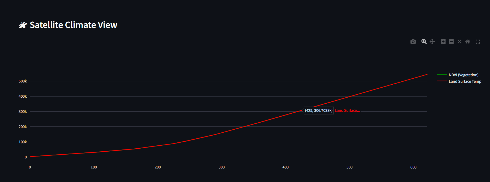
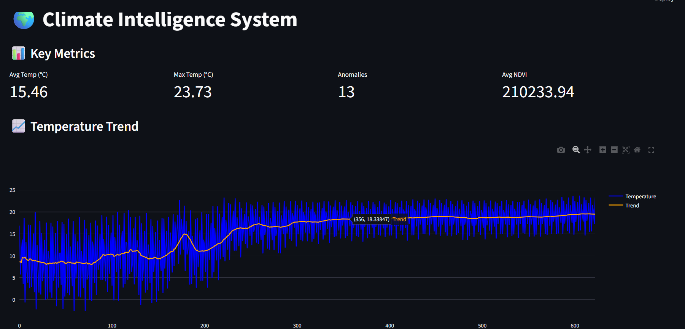
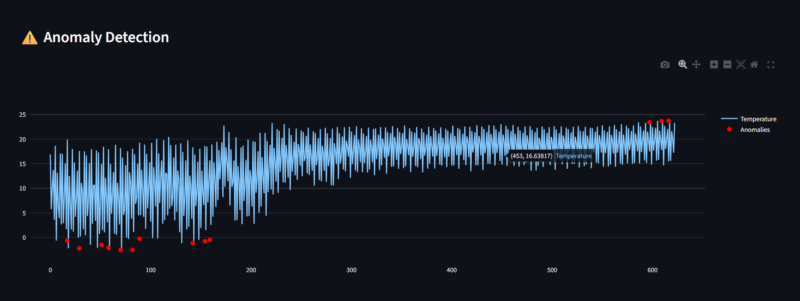
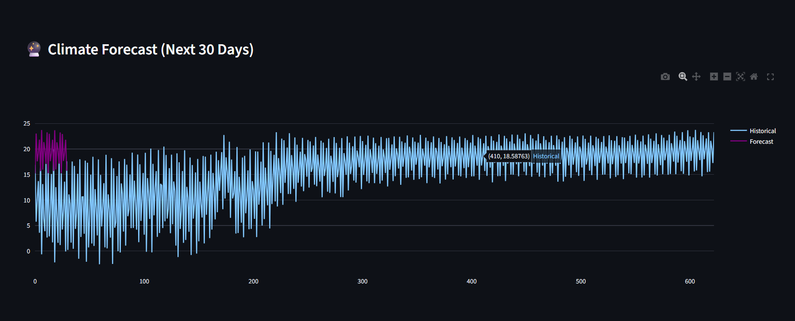

🌍 Climate Intelligence System

A Machine Learning-powered Climate Analytics System that analyzes historical climate data, detects anomalies, and visualizes climate trends using an interactive Streamlit dashboard.

📌 Project Overview

The Climate Intelligence System is designed to simulate real-world environmental data analysis. It processes climate datasets, applies feature engineering, performs anomaly detection, and generates insights using visual analytics.

This project demonstrates end-to-end Data Science workflow including:
Data preprocessing
Time-series analysis
Feature engineering
Anomaly detection
Visualization dashboard

🚀 Features
📊 Climate data preprocessing pipeline
📈 Temperature trend analysis
⚠️ Anomaly detection system
🛰 Satellite data simulation integration
🔮 Forecasting future climate trends
📉 Rolling average smoothing
🌐 Interactive Streamlit dashboard

🧠 Tech Stack
Python
Pandas
NumPy
Plotly
Matplotlib
Scikit-learn
Streamlit

📂 Project Structure
Climate-Intelligence-System/
│
├── app/
├── src/
├── data/
├── images/
├── outputs/
├── requirements.txt
├── README.md

📸 Dashboard Screenshots
🌍 Climate Intelligence Dashboard
📈 Temperature Trend Analysis
Shows long-term climate variation and rolling average smoothing.
⚠️ Anomaly Detection
Red markers indicate unusual climate patterns or spikes.
🔮 Climate Forecasting
Future temperature prediction using time-series modeling.

⚙️ Installation
1️⃣ Clone Repository
git clone https://github.com/your-username/climate-intelligence-system.git
cd climate-intelligence-system
2️⃣ Install Dependencies
pip install -r requirements.txt
▶️ Run Project
streamlit run app/app.py

📊 Workflow
Load climate dataset
Clean and preprocess data
Merge satellite simulation data
Feature engineering (rolling mean, anomalies)
Visualization and forecasting
Dashboard generation using Streamlit

📊 Sample Outputs
Temperature trend graphs
Anomaly detection visualization
Satellite NDVI & LST simulation
Forecasting plots
Climate summary statistics

🚀 Business Value
This project demonstrates how climate data can be used for:
Environmental monitoring
Climate risk prediction
Smart city planning
Agricultural forecasting
Sustainability research

📸 Screenshots Folder Structure
images/
├── dashboard.png
├── trend.png
├── anomaly.png
├── forecast.png

📸 Screenshots
🌍 Satellite Climate View

📈 Temperature Trend

⚠️ Anomaly Detection

🔮 Forecasting

🚀 Future Improvements
🌐 Real NASA API integration
🛰 Live satellite data ingestion
🤖 Deep learning-based forecasting (LSTM)
🌍 Regional climate comparison dashboard
📡 Real-time environmental monitoring system

👨‍💻 Author
Shweta Singh
B.Tech ECM (AI/ML)